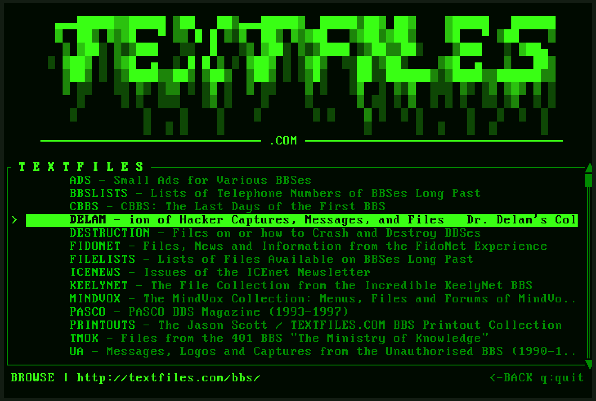

# TEXTFILES.COM Browser

*Back when the internet was weird, wonderful, and made entirely of text.*



A terminal browser for [textfiles.com](http://textfiles.com) — Jason Scott's incredible archive of BBS-era text files. Anarchy cookbooks, hacker manifestos, game walkthroughs, conspiracy theories, and digital folklore from the 1980s-90s. Before social media. Before web 2.0. Before everything got sanitized.

This is how we used to browse.

## Build

```bash
git clone <repo>
cd textfiles
cargo build --release
./target/release/textfiles-browser
```

## Controls

- `j/k` or arrows — navigate
- `Enter` — open
- `Backspace` — go back
- `q` — quit

## Requirements

Rust 1.75+ and a mass case of nostalgia.

---

*"The files are out there."* — textfiles.com
