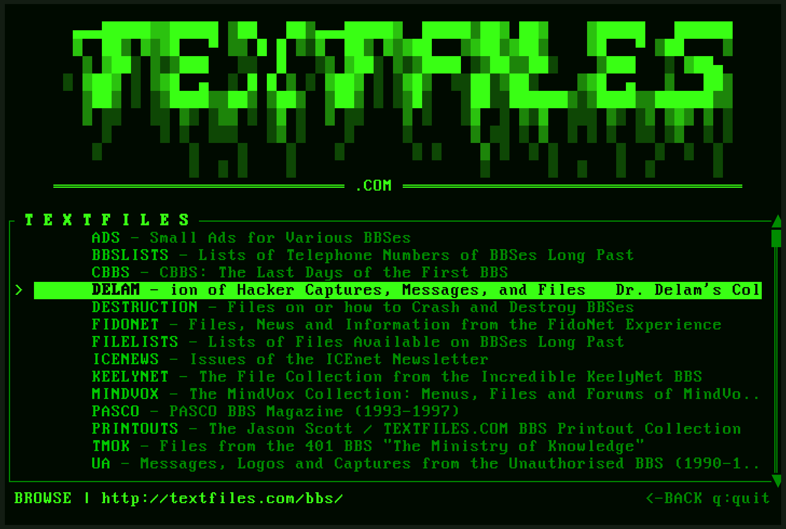

# TEXTFILES.COM Browser

[](LICENSE)
[](Cargo.toml)

*Back when the internet was weird, wonderful, and made entirely of text.*



A terminal browser for [textfiles.com](http://textfiles.com) — Jason Scott's archive of BBS-era text files. Anarchy cookbooks, hacker manifestos, game walkthroughs, conspiracy theories, and digital folklore from the 1980s and 90s. Before social media. Before web 2.0. Before everything got sanitized.

This is how we used to browse.

## Install

```bash
cargo install --git https://github.com/nesdeq/textfiles
textfiles-browser
```

Or build from source:

```bash
git clone https://github.com/nesdeq/textfiles
cd textfiles
cargo build --release
./target/release/textfiles-browser
```

## Controls

| Key                       | Action      |
| ------------------------- | ----------- |
| `j` / `k` / arrows        | Navigate    |
| `g` / `G`                 | Top / end   |
| `PgUp` / `PgDn`           | Page jump   |
| `Enter`                   | Open        |
| `Backspace` / `Esc`       | Back        |
| `r`                       | Refresh     |
| `q` / `Ctrl-C`            | Quit        |

In the text viewer, `b` / `Space` page up and down.

## Old School Mode

For the authentic 1990s BBS experience, use the included launcher scripts:

```bash
./run.sh    # POSIX shell
./run.fish  # fish shell
```

These launch the browser in Alacritty with:

- 80×30 character grid (classic DOS text mode)
- Perfect DOS VGA 437 font at 32pt
- Phosphor green on black

### Optional dependencies

- [Alacritty](https://alacritty.org/) — GPU-accelerated terminal
- [Perfect DOS VGA 437](https://github.com/CP437/PerfectDOSVGA437) — authentic DOS font

## Built with

- [ratatui](https://ratatui.rs/) — terminal UI framework
- [crossterm](https://github.com/crossterm-rs/crossterm) — cross-platform terminal control
- [reqwest](https://github.com/seanmonstar/reqwest) — HTTP client
- [scraper](https://github.com/causal-agent/scraper) — HTML parsing

## Requirements

Rust 1.85+ (2024 edition) and a massive case of nostalgia.

## License

MIT — see [LICENSE](LICENSE).

---

*"The files are out there."* — textfiles.com
